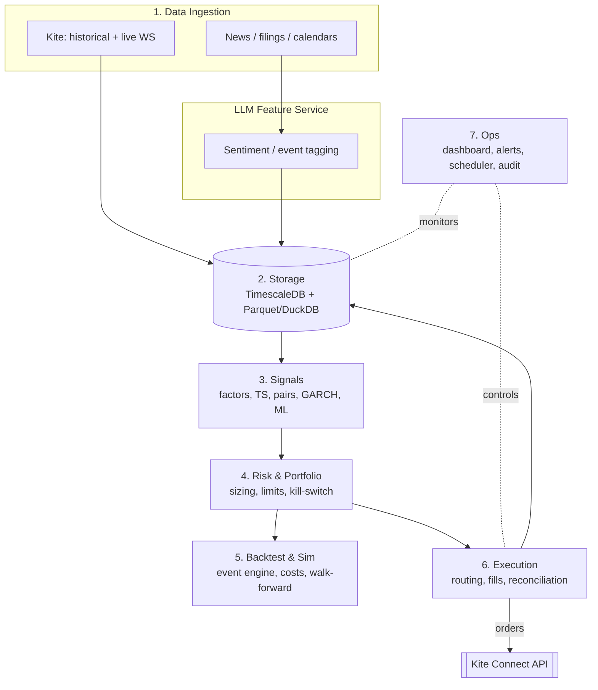
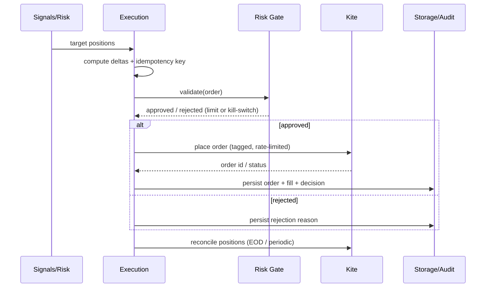
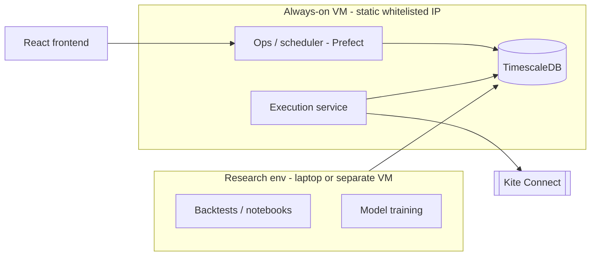

# High-Level Design (HLD) — qtrade

**Status:** Draft v1.0 · 2026-08-01
**Related:** `../Trading_Automation_Roadmap.docx` (roadmap), `LLD.md` (low-level), `adr/` (decisions), `../CLAUDE.md` (rules)

---

## 1. Purpose & Scope

`qtrade` is a personal, single-account systematic trading platform for Indian markets
(NSE / BSE / MCX), executing through Zerodha Kite Connect. This document defines the
system's architecture, components, data flows, deployment topology, and the boundaries that
keep it correct and compliant. It is intentionally implementation-light; concrete interfaces,
schemas, and concurrency/locking live in `LLD.md`.

### In scope
- Market-data ingestion, storage, signal research, risk/portfolio construction, backtesting,
  paper trading, and compliant live execution for one account.
- Equities and ETFs first; gold/silver ETFs, F&O, and IPOs as later, isolated modules.

### Out of scope
- True HFT (colocation/FPGA/microsecond latency). Reframed as low-latency systematic trading.
- Multi-user, strategy distribution, or anything requiring exchange registration / RA licensing.

## 2. Goals & Non-Goals

**Goals**
1. Correctness over speed: an honest backtester and a single source of truth for positions.
2. Safety by construction: risk checks and a kill-switch that no code path can bypass.
3. Compliance by design: orders only via the registered Kite API from a static IP, tagged and rate-limited.
4. Evolvability: strategies and models swap without touching execution; disciplined self-improvement.

**Non-Goals**
- Lowest-possible latency (until Stage 2 intraday, and only where measured).
- A general-purpose framework. This serves one account and one operator.

## 3. Architecture Overview

Seven decoupled layers plus an upstream LLM feature service. The research/backtest plane and the
live-execution plane share signal code but run as separate processes with separate credentials —
only the execution service holds order-placement keys.

### Two planes
- **Research plane** (offline/scheduled): Ingest → Storage → Signals → Risk → Backtest. No live keys.
- **Execution plane** (live): Storage → Signals → Risk → Execution → Kite. Holds live keys; static IP.

Both call the *same* `signals` and `risk` code, guaranteeing what you backtest is what you trade.

## 4. Component Responsibilities

| # | Component | Responsibility | Must not |
|---|---|---|---|
| 1 | `data` | Pull Kite historical candles + live WebSocket ticks; corporate actions; news feeds. Normalize to canonical instruments. | Make trading decisions. |
| — | `llm` | Turn news/filings into calibrated sentiment/event **features**. | Size positions or trigger orders. |
| 2 | `storage` | Point-in-time-correct persistence; adjusted series; research datasets. | Serve look-ahead data. |
| 3 | `signals` | Compute features and produce per-instrument expected-return + confidence. | Place orders or hold broker state. |
| 4 | `risk` | Position sizing, portfolio construction, hard limits, drawdown kill-switch. | Be bypassed by any order path. |
| 5 | `backtest` | Event-driven simulation with full costs; walk-forward; metrics. | Use future data or ignore costs. |
| 6 | `execution` | Idempotent order routing, slicing, fill handling, broker reconciliation. | Skip risk checks or duplicate orders. |
| 7 | `ops` | Dashboards, alerting, scheduling (Prefect), the audit log, kill-switch control surface. | Hold strategy logic. |

## 5. Data Flow

### 5.1 Research / suggestion flow (nightly)
1. Scheduler triggers ingestion → storage updates (EOD candles, corporate actions, news+sentiment).
2. `signals` computes the day's ranked expected returns + confidence over the universe.
3. `risk` proposes target positions subject to limits.
4. Output: a ranked **buy/sell/hold suggestion list** with reasons → dashboard + audit log.
   (Phase 1: human acts on it. Later: feeds execution.)

### 5.2 Live order flow (Stage 1 swing/daily → Stage 2 intraday)
1. `signals`/`risk` produce target positions vs. current positions → desired **orders (deltas)**.
2. Each order gets a client **idempotency key**; passes risk gate (limits + kill-switch).
3. `execution` routes to Kite (respecting rate/daily budgets), tracks fills, updates positions.
4. End-of-run **reconciliation** compares internal state to broker; discrepancies halt & alert.

### 5.3 Kill-switch flow
`ops`/`risk` monitors drawdown & daily loss. On breach: block new orders atomically, optionally
flatten, alert the operator. Kill-switch state outranks every strategy and model.

## 6. Key Sequence Flows

**Order lifecycle**

## 7. Deployment Topology

- **Execution + DB + scheduler** run on a single always-on VM with a **fixed IP whitelisted** at the broker.
- **Research/training** runs separately (laptop or another VM) against the same DB (read-mostly), never holding live order keys.
- **Frontend** (React) talks to an `ops` API; Streamlit is the interim stand-in.
- Services are containerized (docker-compose); secrets injected from a vault / `.env`, never baked into images.

## 8. Compliance Boundary (SEBI / Kite)

- Live orders flow **only** through the registered Kite Connect API — no scraping or headless login.
- Host uses a **static, whitelisted IP**; orders are **algo-tagged**; request rates stay conservatively
  under Kite's per-second and daily budgets.
- Order frequency kept well below algo-registration thresholds for Stage 1; Stage 2 revisits this explicitly.
- Personal use only — no strategy distribution (which would require exchange registration / RA license).
- Full **audit trail**: every signal, decision, order, and fill is persisted and time-stamped.

## 9. Cross-Cutting Concerns

- **Configuration:** `pydantic-settings` from `.env`; typed config objects; no scattered constants.
- **Secrets:** `.env`/vault only; git-ignored; access tokens never logged.
- **Logging & audit:** structured logs (`structlog`); a durable, append-only audit trail is a first-class store.
- **Time:** UTC internally, IST for display; exchange sessions via `pandas-market-calendars`.
- **Money:** `Decimal`/integer paise for cash; never bare floats where correctness matters.
- **Error handling:** fail closed. On unknown order/position state, reconcile before any resend.
- **Environments:** `dev` (mock/sim), `paper` (real data, simulated fills), `live` (real orders, guarded).

## 10. Non-Functional Requirements

| Attribute | Target |
|---|---|
| Correctness | No look-ahead in backtests; exactly-once order semantics. |
| Latency (Stage 1) | Irrelevant — decisions at bar close; seconds-to-minutes acceptable. |
| Latency (Stage 2) | Bounded, measured; engineered only where the broker round-trip is not the limit. |
| Reliability | Reconciliation catches drift; kill-switch halts on breach; restart-safe (idempotent). |
| Auditability | Every decision & order reconstructable from the audit log. |
| Testability | Risk limits, kill-switch, idempotency, and no-look-ahead each have explicit tests. |
| Security | Least privilege; only execution holds live keys; secrets isolated. |

## 11. Technology Decisions (see `adr/`)

Python for research + ML + execution; TimescaleDB (+ Parquet/DuckDB); React frontend (Streamlit interim);
Prefect orchestration; static-IP VM. Rationale and alternatives are recorded as ADRs.

## 12. Risks & Open Questions

- **Overfitting / backtest optimism** — mitigated by walk-forward, purged CV, deflated Sharpe, paper gating.
- **Kite API limits & downtime** — design around daily/per-second budgets; degrade safely; reconcile on reconnect.
- **Data quality / corporate actions** — dedicated validation; include delisted names (survivorship).
- **Regulatory change** — SEBI algo rules evolve; keep the compliance boundary configurable.
- **Open:** universe definition (which indices/instruments) and initial capital — to be set in Phase 0.

---
*Next: `LLD.md` — module interfaces, data models/schemas, API contracts, and concurrency & locking design.*
