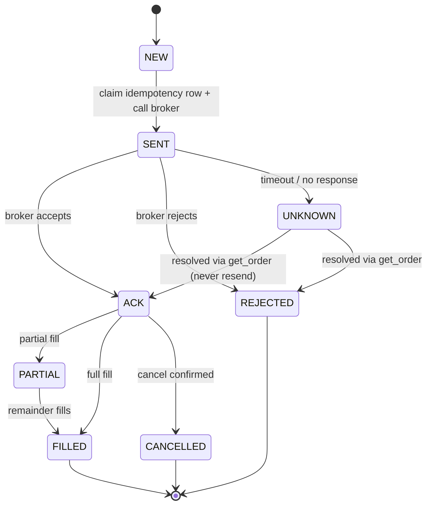

# Low-Level Design (LLD) — qtrade

**Status:** Draft v1.0 · 2026-08-01
**Related:** `HLD.md`, `adr/`, `../CLAUDE.md`

This document specifies concrete interfaces, data models, database schemas, the broker adapter,
the backtester loop, and — centrally — the concurrency & locking design. Code sketches are
illustrative signatures, not final implementations.

---

## 1. Conventions

- Python 3.10+, `src/` layout, package `qtrade`. Full type hints; `mypy` strict-ish.
- Domain models are immutable `pydantic`/`dataclass` value objects.
- Money as integer **paise** (`int`) or `Decimal`; never bare float for cash.
- Time as timezone-aware UTC (`datetime`); IST only at display edges.
- Interfaces expressed as `typing.Protocol` (ports) so implementations (real vs paper) are swappable.

## 2. Canonical Domain Models (`qtrade.common.types`)

```python
class Exchange(str, Enum): NSE="NSE"; BSE="BSE"; MCX="MCX"
class Side(str, Enum): BUY="BUY"; SELL="SELL"
class AssetClass(str, Enum): EQUITY="EQUITY"; ETF="ETF"; FUT="FUT"; OPT="OPT"; COMMODITY="COMMODITY"

class Instrument(BaseModel):          # canonical, broker-agnostic
    symbol: str                        # e.g. "INFY"
    exchange: Exchange
    asset_class: AssetClass
    instrument_token: int              # Kite token
    lot_size: int = 1
    tick_size: Decimal

class Bar(BaseModel):                  # OHLCV, adjusted
    token: int; ts: datetime           # bar close time, UTC
    open: Decimal; high: Decimal; low: Decimal; close: Decimal; volume: int

class Signal(BaseModel):
    token: int; ts: datetime
    expected_return: float             # forward-return estimate
    confidence: float                  # 0..1
    horizon_days: float
    rationale: str

class TargetPosition(BaseModel):
    token: int; target_qty: int        # signed: +long / -short

class OrderRequest(BaseModel):
    token: int; side: Side; qty: int
    order_type: Literal["MARKET","LIMIT"]
    limit_price: Decimal | None = None
    idempotency_key: str               # client-generated; see sec 7
    strategy_id: str

class OrderState(str, Enum):
    NEW="NEW"; SENT="SENT"; ACK="ACK"; PARTIAL="PARTIAL"; FILLED="FILLED"
    REJECTED="REJECTED"; CANCELLED="CANCELLED"; UNKNOWN="UNKNOWN"

class Order(BaseModel):
    idempotency_key: str; broker_order_id: str | None
    request: OrderRequest; state: OrderState
    filled_qty: int = 0; avg_price: Decimal | None = None
    created_at: datetime; updated_at: datetime

class Fill(BaseModel):
    broker_order_id: str; token: int; side: Side
    qty: int; price: Decimal; ts: datetime; fee: Decimal

class Position(BaseModel):
    token: int; qty: int; avg_price: Decimal; realized_pnl: Decimal
```

## 3. Module Interfaces (ports)

```python
# qtrade.data
class MarketDataPort(Protocol):
    def historical(self, token: int, start: datetime, end: datetime, interval: str) -> list[Bar]: ...
    def subscribe(self, tokens: list[int], on_tick: Callable[[Tick], None]) -> None: ...

# qtrade.storage
class BarStore(Protocol):
    def upsert_bars(self, bars: list[Bar]) -> None: ...
    def get_bars(self, token: int, start: datetime, end: datetime) -> list[Bar]: ...   # point-in-time only

# qtrade.signals
class SignalModel(Protocol):
    def fit(self, panel: "Panel") -> None: ...
    def predict(self, asof: datetime) -> list[Signal]: ...   # uses only data <= asof (no look-ahead)

# qtrade.risk
class RiskEngine(Protocol):
    def size(self, signals: list[Signal], positions: list[Position]) -> list[TargetPosition]: ...
    def validate(self, order: OrderRequest, ctx: "RiskContext") -> "RiskDecision": ...  # limits + kill-switch

# qtrade.execution
class BrokerPort(Protocol):                 # real Kite adapter OR paper/sim
    def place(self, req: OrderRequest) -> Order: ...
    def cancel(self, broker_order_id: str) -> None: ...
    def get_order(self, broker_order_id: str) -> Order: ...
    def positions(self) -> list[Position]: ...

class ExecutionService(Protocol):
    def reconcile_to_targets(self, targets: list[TargetPosition]) -> list[Order]: ...
    def reconcile_with_broker(self) -> "ReconResult": ...
```

The **same** `SignalModel` + `RiskEngine` instances are driven by both the backtester and the live
execution service — guaranteeing backtest/live parity.

## 4. Database Schema (TimescaleDB)

```sql
-- reference
CREATE TABLE instrument (
    token BIGINT PRIMARY KEY, symbol TEXT NOT NULL, exchange TEXT NOT NULL,
    asset_class TEXT NOT NULL, lot_size INT NOT NULL DEFAULT 1, tick_size NUMERIC NOT NULL,
    active BOOLEAN NOT NULL DEFAULT TRUE);

-- time series (hypertables)
CREATE TABLE bar (
    token BIGINT NOT NULL, ts TIMESTAMPTZ NOT NULL, interval TEXT NOT NULL,
    open NUMERIC, high NUMERIC, low NUMERIC, close NUMERIC, volume BIGINT,
    PRIMARY KEY (token, interval, ts));
SELECT create_hypertable('bar','ts');

CREATE TABLE corporate_action (
    token BIGINT, ex_date DATE, kind TEXT, ratio NUMERIC, PRIMARY KEY(token, ex_date, kind));

CREATE TABLE news_feature (
    id BIGSERIAL PRIMARY KEY, token BIGINT, ts TIMESTAMPTZ NOT NULL,
    sentiment NUMERIC, event_type TEXT, source TEXT, raw_ref TEXT);   -- LLM output, upstream feature

-- trading state
CREATE TABLE signal (
    token BIGINT, ts TIMESTAMPTZ, strategy_id TEXT,
    expected_return DOUBLE PRECISION, confidence DOUBLE PRECISION, rationale TEXT,
    PRIMARY KEY(token, ts, strategy_id));

CREATE TABLE "order" (
    idempotency_key TEXT PRIMARY KEY,          -- exactly-once guard (sec 7)
    broker_order_id TEXT UNIQUE,
    token BIGINT, side TEXT, qty INT, order_type TEXT, limit_price NUMERIC,
    strategy_id TEXT, state TEXT NOT NULL, filled_qty INT DEFAULT 0, avg_price NUMERIC,
    created_at TIMESTAMPTZ DEFAULT now(), updated_at TIMESTAMPTZ DEFAULT now());

CREATE TABLE fill (
    id BIGSERIAL PRIMARY KEY, broker_order_id TEXT REFERENCES "order"(broker_order_id),
    token BIGINT, side TEXT, qty INT, price NUMERIC, fee NUMERIC, ts TIMESTAMPTZ);

CREATE TABLE position (                          -- single source of truth (one row per token)
    token BIGINT PRIMARY KEY, qty INT NOT NULL, avg_price NUMERIC NOT NULL,
    realized_pnl NUMERIC NOT NULL DEFAULT 0, version BIGINT NOT NULL DEFAULT 0,  -- optimistic lock
    updated_at TIMESTAMPTZ DEFAULT now());

CREATE TABLE risk_state (                         -- singleton row id=1
    id INT PRIMARY KEY DEFAULT 1, kill_switch BOOLEAN NOT NULL DEFAULT FALSE,
    reason TEXT, day_start_equity NUMERIC, updated_at TIMESTAMPTZ DEFAULT now());

CREATE TABLE audit_log (                          -- append-only
    id BIGSERIAL PRIMARY KEY, ts TIMESTAMPTZ DEFAULT now(),
    kind TEXT, payload JSONB);
```

## 5. Broker Adapter (`qtrade.execution.broker`)

- `KiteBroker` implements `BrokerPort` over `kiteconnect`: maps canonical `OrderRequest` <-> Kite params,
  applies **algo tagging**, and passes through a **rate limiter** (sec 7.5).
- `PaperBroker` implements the same `BrokerPort`, simulating fills against live/replayed data with the
  cost model. All tests and `paper`/`dev` envs use it. Live keys are injected only into `KiteBroker`
  and only when `QTRADE_ENV=live` and `LIVE_TRADING_ENABLED=true`.

## 6. Backtester Event Loop (`qtrade.backtest`)

- Event-driven, single clock advancing over bar-close timestamps.
- **No-look-ahead guarantee:** at time `t`, `SignalModel.predict(asof=t)` may read only rows with
  `ts <= t`; the store enforces this by rejecting future reads in backtest mode.
- Loop: `for t in timeline: signals = model.predict(t); targets = risk.size(...); orders =
  sim_execution(targets, fills_at=next_open); portfolio.update(fills)`.
- **Cost model** applied on every fill: brokerage, STT, exchange txn, GST, stamp duty, SEBI fee,
  slippage (spread-based), and market impact (size/ADV based). Same model powers `PaperBroker`.
- Outputs: equity curve, per-trade log, and metrics (Sharpe/Sortino/Calmar, max drawdown, turnover,
  hit rate, deflated Sharpe). Walk-forward harness wraps fit/predict over rolling windows.

## 7. Concurrency & Locking Design (critical)

The execution plane is where races cost real money. Design goal: **exactly-once order semantics and a
single source of truth for positions**, safe across retries, reconnects, and restarts.

### 7.1 Idempotency keys (exactly-once placement)
- Every intended order gets a deterministic `idempotency_key` derived from
  `(strategy_id, token, side, qty, decision_bar_ts)` via a stable hash. Same intent → same key.
- `place()` first `INSERT ... ON CONFLICT (idempotency_key) DO NOTHING` into `"order"`. If the row
  already exists, the order was already sent — **return the existing order, do not resend.**
- Only after the row is claimed does the adapter call Kite. The broker id is written back on ACK.
- Result: a retry, duplicate tick, or process restart can never create a second broker order.

### 7.2 Single-writer position store (no lost updates)
- Exactly **one** execution process is authoritative for writes (single-writer). Positions carry a
  `version` column; updates use **optimistic concurrency**:
  `UPDATE position SET qty=?, version=version+1 WHERE token=? AND version=?` — zero rows affected
  means a concurrent change occurred → reload and retry.
- Position mutations and the corresponding `fill`/`order` state change happen in **one DB
  transaction**, so state never partially updates.

### 7.3 Serializing per-instrument work
- Order placement/updates for a given `token` are serialized with a **Postgres advisory lock**
  (`pg_advisory_xact_lock(token)`) held for the transaction — prevents two flows from acting on the
  same instrument simultaneously without locking the whole table.

### 7.4 Atomic kill-switch
- `risk_state.kill_switch` is a single row read inside the same transaction that validates an order.
  Check ordering is strict: **read kill-switch → validate limits → claim idempotency row → send.**
- Setting the kill-switch is a single atomic `UPDATE`; once true, `RiskEngine.validate` rejects all new
  orders. Because the check is inside the order transaction, no order can "slip past" a concurrent trip.
- The kill-switch also has a fast in-process cached flag refreshed on a short interval for hot loops,
  but the DB value is authoritative and always re-checked in the placement transaction.

### 7.5 Rate limiting (Kite budgets)
- A **token-bucket** limiter guards the Kite adapter for per-second limits; a **daily counter**
  (persisted) guards the daily request/order budget. When the daily budget nears exhaustion, execution
  degrades gracefully (defers non-urgent orders, alerts) rather than erroring blindly.

### 7.6 Restart & crash safety
- On startup the service runs **reconciliation** before doing anything: pull broker orders/positions,
  compare to the DB, resolve `UNKNOWN` orders by querying the broker (never by resending), and only then
  resume. Fail closed: if reconciliation can't complete, stay halted and alert.

### 7.7 Live vs backtest concurrency
- The backtester is single-threaded and deterministic — no locking needed, and determinism is a feature
  (reproducible results). Locking concerns apply only to the live execution plane.

## 8. Order State Machine


Transitions are persisted; `UNKNOWN` is always resolved by **querying** the broker, never by resending.

## 9. Configuration (`qtrade.common.config`)

```python
class Settings(BaseSettings):            # pydantic-settings, reads .env
    env: Literal["dev","paper","live"] = "dev"
    live_trading_enabled: bool = False
    database_url: str
    kite_api_key: str | None = None
    kite_api_secret: SecretStr | None = None
    max_daily_loss_pct: float = 2.0
    max_position_pct: float = 10.0       # per-name cap
    max_gross_leverage: float = 1.0
    # live orders require env=="live" AND live_trading_enabled — enforced in the broker factory
```

## 10. Error Handling & Failure Modes (fail closed)

| Failure | Response |
|---|---|
| Broker timeout on place | Mark `UNKNOWN`; resolve via `get_order`; never blind-resend. |
| WebSocket disconnect | Reconnect with backoff; on resume, reconcile before acting. |
| DB unavailable | Halt new orders (can't claim idempotency row / write audit). |
| Kill-switch tripped | Reject all new orders; optional flatten; alert. |
| Daily budget exhausted | Defer non-urgent orders; alert; do not error-loop. |
| Reconciliation mismatch | Halt, alert operator; require manual/automated resolution before resuming. |

## 11. Testing Strategy (specifics)

- **Idempotency:** placing the same intent twice (incl. across a simulated restart) yields exactly one order.
- **Kill-switch:** with switch tripped, every `validate` rejects; concurrent trip mid-batch blocks the rest.
- **Optimistic lock:** concurrent position updates — one wins, the other retries; no lost update.
- **No-look-ahead:** backtester read of a future bar raises in backtest mode.
- **Cost model:** fills apply the exact Indian charge stack; parity between backtest and `PaperBroker`.
- **State machine:** every transition and the `UNKNOWN` resolution path is covered.
- Integration tests run against `PaperBroker` + a disposable Postgres; **never** live credentials.

## 12. Open Items (resolve in Phase 0)

- Final universe (indices/instruments) and initial capital.
- Exact Indian charge constants (rates for STT/stamp/txn/GST) in the cost model — verify current values.
- Hosting choice for the static-IP VM and vault for secrets.
- Whether Stage-1 uses market-on-close vs. next-open fills as the modeling assumption.

---
*Next per the refined order: populate `.claude/agents/` and project `.claude/skills/` to enforce this
design, then begin Phase 0 coding.*
